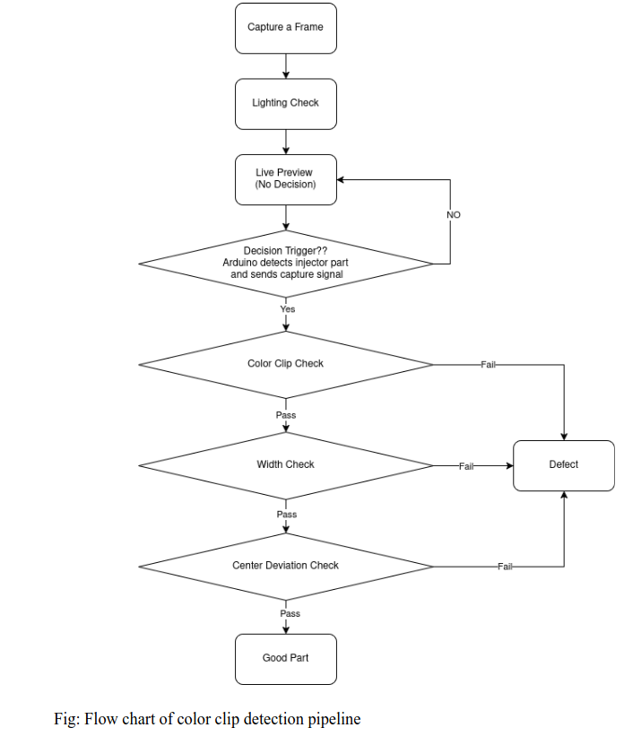
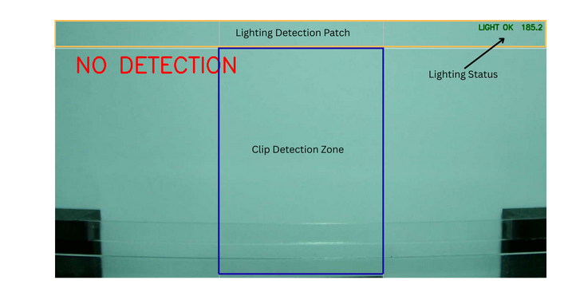
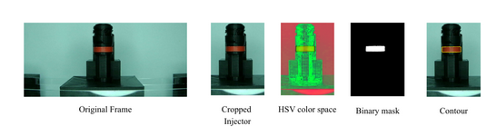
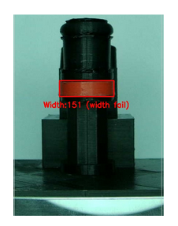
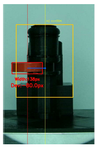
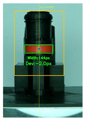

# Automated Injector Clip Inspection System

A machine vision system that automatically inspects fuel injector color clips on a production line, detecting missing, broken, or misaligned clips in real time.

---

## Overview

The system uses a USB camera triggered by an Arduino IR sensor to capture images of injector parts as they pass through an inspection zone. Each captured image is processed through a pipeline of checks to classify the part as **Good** or **Defect**.

**Detection pipeline:**
1. Lighting Check
2. Color Clip Check
3. Width Check
4. Center Deviation Check

---

## Hardware

| Component | Specification |
|---|---|
| Camera | IMX307 — 1224×640 @ 60fps, USB 3.0 |
| Pixel Size | 2.9 µm × 2.9 µm |
| Trigger | Arduino + IR sensor |
| Lighting | LED (mounted on top of camera) |
| Camera distance | 16 cm from object |

The camera is enclosed in a box to eliminate environmental lighting noise.

---

## System Flow



---

## Checks

### Lighting Check
Crops the top patch of the frame, reads the HSV V-channel mean brightness, and compares it against a baseline ± 10% tolerance recorded during data collection.


### Color Clip Check
Converts the frame to HSV, applies a color threshold for the orangenclip, finds contours in the binary mask. No contour → **No Clip**.


### Width Check
Fits a minimum area rectangle around the clip contour. The longer side = clip width. Compared against `mean ± 4σ` boundaries.
- `W > upper` → Clip Not Fully Snapped
- `W < lower` → Clip Broken


### Deviation Check
Detects the injector body center using an HSV dark-color mask and fits a min-area rectangle to find its axis. Measures the pixel distance from the clip center to the injector axis. Compared against `mean ± 6σ` boundaries.


### Pass all checks (Good)


---

## Files

| File | Description |
|---|---|
| `live_detect.py` | Main live inspection loop |
| `data_collect.py` | Captures good-part images via Arduino trigger |
| `get_stats.py` | Computes mean/std statistics from collected images |
| `SNR.py` | Measurement System Analysis (Signal-to-Noise Ratio) |
| `visual_steps.py` | Debug tool that saves each processing step as an image |
| `trigger_capture.ino` |reads IR sensor, sends trigger|

---

## Setup

### 1. Install dependencies
```bash
pip install opencv-python numpy matplotlib pyserial
```

### 2. Upload Arduino sketch
Upload `trigger_capture.ino` to the Arduino via Arduino IDE.

### 3. Collect good-part data
```bash
python data_collect.py
```
Capture ~50 images of good parts.

### 4. Compute statistics
```bash
python get_stats.py
```
Outputs mean/std for width, deviation, and brightness used as decision boundaries.

### 5. Run live inspection
```bash
python live_detect.py
```

---

## Results

### Measurement System Analysis (SNR)
- Method: Average Range Method (20 parts, 2 trials each)
- **SNR = 14.9** — exceeds AIAG MSA minimum threshold of 5

### Confusion Matrix (20 good + 20 defect parts)
|  | Actual Good | Actual Defect |
|---|---|---|
| Detected Good | ~100% | ~0% |
| Detected Bad | ~0% | ~100% |

### False Positive Rate
- Width (±4σ) + Deviation (±6σ): **~64 parts per million**

### False Negative Rate
- Assuming bad part width = good mean + 1mm: **~224 parts per million**

### Inspection Time
| Method | Mean Decision Time |
|---|---|
| Manual | 2.575 s |
| Automated (Good part) | 0.00388 s |
| Automated (Defect) | 0.00299 s |

---
